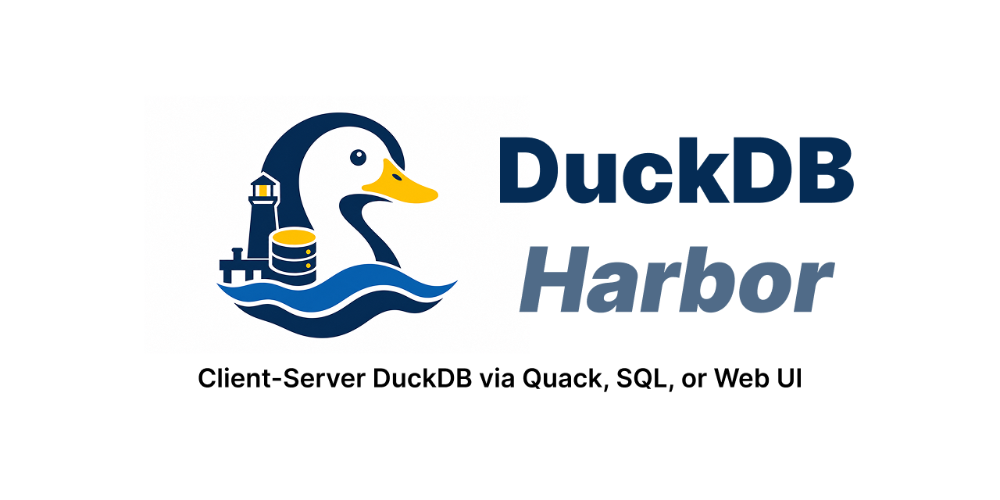

<p align="center">
  
</p>

# duckdb-harbor

> **One port for the DuckDB UI, JSON SQL, and Quack RPC — backed by one in-process DuckDB.**

`harbor` turns a DuckDB process into a small HTTP gateway: open the official DuckDB UI in a browser, run SQL with `curl`, or connect with Quack RPC — all against the same in-process DuckDB, on the same port, with the same auth rules.

```
GET  /         DuckDB UI
POST /sql      JSON SQL endpoint (NDJSON streaming or one-shot JSON)
POST /quack    Quack binary RPC (for `ATTACH 'quack:host'` clients)
POST /ddb/*    DuckDB UI backend routes
```

Harbor runs **inside** the DuckDB process — when DuckDB exits, the HTTP server exits with it. It's designed for local tools, notebooks, agents, internal services, and small deployments where you want DuckDB reachable over HTTP without assembling three separate servers and reconciling three separate auth schemes.

---

## Quick start

```sql
INSTALL harbor FROM community;
LOAD harbor;
CALL harbor_serve('harbor:127.0.0.1:9494');
```

```text
┌───────────────────────┬───────────────────────┬──────────────────────────────────┐
│       listen_uri      │       listen_url      │            auth_token            │
├───────────────────────┼───────────────────────┼──────────────────────────────────┤
│ harbor:127.0.0.1:9494 │ http://127.0.0.1:9494 │ a1b2c3d4e5f67890abcdef1234567890 │
└───────────────────────┴───────────────────────┴──────────────────────────────────┘
```

Open `http://127.0.0.1:9494/` in a browser. The page asks for the token once, sets a `HttpOnly; SameSite=Strict` cookie, then the official DuckDB UI loads.

Hit `/sql` from anywhere:

```bash
TOKEN='a1b2c3d4e5f67890abcdef1234567890'

curl http://127.0.0.1:9494/sql \
  -H "Authorization: Bearer $TOKEN" \
  -H 'Content-Type: application/json' \
  -d '{"sql":"SELECT 42 AS answer"}'
```

```json
{"ok":true,"kind":"select","columns":[{"name":"answer","duckdbType":"INTEGER","lossless":true}],"data":[[42]],"rowCount":1,"timeMs":0}
```

Or attach from a second DuckDB instance over Quack RPC:

```sql
-- in another DuckDB session:
INSTALL quack FROM community;
LOAD quack;
CREATE SECRET harbor_remote (TYPE quack, AUTH_TOKEN 'a1b2c3...');
ATTACH 'quack:127.0.0.1:9494' AS remote (SECRET harbor_remote);
SELECT * FROM remote.main.your_table;
```

> **Heads-up for non-interactive use.** `harbor_serve` returns immediately so your DuckDB REPL stays usable. To run as a daemon (containers, systemd) — keep the process alive with `CALL harbor_wait();` after `harbor_serve(...)`.

---

## Why harbor?

DuckDB already has the pieces:

- the official **DuckDB UI** for interactive work,
- **Quack** for binary RPC clients,
- various **httpserver-style** community extensions for HTTP + SQL.

Harbor combines the useful deployment shape:

> **One DuckDB, one port, three protocols, one auth decision.**

The hard part isn't starting an HTTP server. The hard part is making the browser UI, API clients, and RPC clients share the same identity, authorization rules, CORS policy, and database state. Stacking three independent extensions side-by-side gets you three servers, three ports, three auth dances, three logs, and three lifecycle stories. Harbor gives them one shared boundary:

- **One port, three surfaces.** UI in a browser, JSON SQL from any HTTP client, Quack RPC for stock DuckDB clients — all against the same in-process DuckDB.
- **One auth/authz boundary.** Browser-friendly cookies and API-friendly bearer tokens use the same principal; one `harbor_authorization_function` runs for every SQL-bearing request, including admin endpoints.
- **Sessions tied to the authenticated principal.** Browser and API requests can't accidentally share state across users; wrong-principal session lookups return `404 SESSION_NOT_FOUND` instead of leaking ids.
- **Typed JSON + NDJSON streaming.** `BIGINT` / `HUGEINT` values are JSON numbers when they fit JavaScript's safe-integer range and strings only when precision requires it; `DECIMAL` stays string-encoded to preserve scale. `MAP<K,V>` is array-of-pairs (non-string keys, ordered), `INTERVAL` is `{months, days, micros}`. Round-trip tested per type. `/sql` streams `DataChunk`s with mid-stream error reporting.
- **Wire compatibility with stock clients.** A vanilla DuckDB with the upstream `quack` extension can `ATTACH 'quack:host'` against harbor without modification. The official DuckDB UI works against `GET /` and `POST /ddb/*` byte-for-byte.

---

## Authentication modes

Harbor has three operational postures, all selected at `harbor_serve` time. There is **no `harbor_local_dev_mode` setting** — the token argument value picks the mode.

| Call | Meaning | Use |
|---|---|---|
| `harbor_serve('harbor:host:port')` | Auto-generate a random token. Default authentication. | Local dev or quick demo. |
| `harbor_serve('harbor:host:port', token := 'my-secret')` | Operator-supplied static token. Default authentication. | Single-operator service. |
| `harbor_serve('harbor:127.0.0.1:9494', token := NULL)` | **Unauthenticated.** All routes accept any caller; synthetic principal is `harbor.local-dev`. **Refuses to start unless bound to loopback.** | Local development without the token-paste step. |
| Custom `harbor_authentication_function` + omitted `token` | Operator-defined authentication callback decides validity per request. | Multi-tenant production, RBAC, JWT, etc. |

### Invalid combinations (surfaced loudly)

```sql
-- token := '' is rejected: empty strings are usually env-var-plumbing accidents.
-- Use token := NULL if you genuinely want unauthenticated loopback mode.
CALL harbor_serve('harbor:127.0.0.1:9494', token := '');
-- → InvalidInputException

-- Custom authn + any token argument is rejected: the callback owns
-- the decision; a static token would be dead config.
SET GLOBAL harbor_authentication_function = 'my_authn';
CALL harbor_serve('harbor:0.0.0.0:9494', token := 'should-be-rejected');
-- → InvalidInputException

-- The legacy harbor_local_dev_mode setting is rejected on SET.
SET GLOBAL harbor_local_dev_mode = true;
-- → InvalidInputException pointing at token := NULL
```

### What "unauthenticated" means concretely

In `token := NULL` mode harbor still validates protocol framing (Quack's binary `CONNECTION_REQUEST` is parsed and validated; only the credential comparison short-circuits). What it doesn't do is check who you are — it stamps every request with the synthetic `harbor.local-dev` principal and lets it through.

Loopback enforcement is the only thing keeping that safe. `harbor_serve` refuses to start with `token := NULL` on a non-loopback bind. There's no way to expose unauthenticated mode to the network from a single SQL call.

---

## Authorization

Authentication answers **who** is calling. Authorization answers **what they can do**, and is fully orthogonal — all three authentication modes pair with whatever `harbor_authorization_function` you configure.

The default authorization callback (`harbor_nop_authorization`) returns `TRUE` for every query except `__HARBOR_ADMIN__:resource:action` synthetic queries (the keys harbor uses for admin endpoints like `/tables`, `/checkpoint`, `/sessions`, `/interrupt`). Those are **default-deny** unless you either:

1. Configure a custom `harbor_authorization_function` that grants specific resource:action pairs to specific principals (see [`examples/auth/rbac-authorization.sql`](examples/auth/rbac-authorization.sql)), OR
2. Set `harbor_allow_admin_without_authz = TRUE` to allow every authenticated principal through (operator opt-in for trusted single-user deployments).

> ⚠️ **Harbor exposes SQL execution.** Anyone authenticated to harbor can do whatever the underlying DuckDB process can do — read any table, `ATTACH` to remote data, `LOAD` extensions, write files to disk — unless your `harbor_authorization_function` denies it. Authentication tells harbor who's at the door; authorization tells the door what to do. Production multi-tenant deployment requires both. See [`examples/auth/`](examples/auth/) for recipes.

---

## Production hardening

`harbor_serve` works out of the box for development. For anything reachable beyond your laptop, the four levers that matter:

### 1. Authentication callback

Replace the default static-token check with a multi-tenant-aware callback:

```sql
.read examples/auth/bearer-table-multi-tenant.sql
SET GLOBAL harbor_authentication_function = 'harbor_check_token_table';
CALL harbor_serve('harbor:0.0.0.0:9494');
```

Recipes in [`examples/auth/`](examples/auth/):
- `bearer-only-static.sql` — single shared token from a row.
- `bearer-table-multi-tenant.sql` — token-per-principal table; revoke by `UPDATE active = FALSE`.
- `bearer-with-expiry.sql` — tokens carry `valid_until`.
- `rbac-authorization.sql` — pair with any of the above for admin-endpoint gating.

### 2. CORS allow-list

If browsers will hit `/sql` or `/info` from a different origin than harbor itself:

```sql
SET GLOBAL harbor_cors_origins = 'https://app.example.com';
-- multiple: 'https://a.example.com;https://b.example.com'
```

`'*'` is **explicitly rejected** at `harbor_serve` time — wildcard CORS on credential-bearing endpoints is unsafe.

### 3. Query timeout

```sql
SET GLOBAL harbor_query_timeout_s = 30;     -- 0 = no limit
```

Catches runaway queries with `HTTP 504 + errorCode: "QUERY_TIMEOUT"` (or a mid-stream `{"type":"error","code":"QUERY_TIMEOUT"}` line on streaming `/sql`).

### 4. Reverse proxy + TLS

Bind harbor on `127.0.0.1` and front it with nginx / Caddy / Traefik for TLS termination. The minimum config:

```nginx
location / {
    proxy_pass         http://127.0.0.1:9494;
    proxy_http_version 1.1;
    proxy_set_header   Host              $host;
    proxy_set_header   X-Forwarded-For   $proxy_add_x_forwarded_for;
    proxy_set_header   X-Forwarded-Proto $scheme;     # required for Secure cookies
    proxy_buffering    off;                            # NDJSON streaming
}
```

`X-Forwarded-Proto: https` is what triggers harbor's `Secure` flag on the `harbor_session` cookie. `proxy_buffering off` matters because `/sql`'s NDJSON streaming wants chunks delivered as DuckDB produces them.

> 💡 **Reverse-proxy with a loopback bind is still unsafe if the proxy fronts the unauthenticated mode.** `token := NULL` is loopback-only by design; don't expose that loopback through a network proxy.

---

## Settings reference (the ones you'll touch)

| Setting | Default | Purpose |
|---|---|---|
| `harbor_authentication_function` | `harbor_check_token` | Name of the SQL function that validates credentials. |
| `harbor_authorization_function` | `harbor_nop_authorization` | Name of the SQL function that authorizes per-statement. |
| `harbor_cors_origins` | `''` | Allow-list for cross-origin browser requests. `'*'` is rejected. |
| `harbor_query_timeout_s` | `0` | Per-query wall-clock limit. `0` disables. |
| `harbor_max_sessions` | `1024` | Max concurrent DB sessions. |
| `harbor_allow_admin_without_authz` | `false` | Operator opt-in: allow any authenticated principal on admin endpoints. |
| `harbor_max_request_body_bytes` | `268435456` | 256 MB per-request body cap. |

Auth/authz settings are **snapshotted at `harbor_serve` startup**. Mid-process `SET GLOBAL` does not affect a running server — restart to apply. (This is what stops an authenticated SQL caller from redirecting auth for everyone else mid-process.)

For the full settings list, route-by-route protocol details, error-code tables, and threat model, see [`SPEC.md`](./SPEC.md).

---

## Running as a service

Harbor is just a DuckDB process with the extension loaded. To run it
under `systemd`, Docker, Incus, Kubernetes, or your own supervisor, use
the same shape everywhere:

```sql
LOAD harbor;
SET GLOBAL harbor_query_timeout_s = 30;
-- Configure authn/authz/CORS here.
CALL harbor_serve('harbor:127.0.0.1:9494');
CALL harbor_wait();
```

`harbor_wait()` keeps the DuckDB process alive until SIGTERM/SIGINT or
`harbor_stop()`. Put that SQL in whatever bootstrap file your process
manager feeds to `duckdb`.

After deploying, validate with:

```bash
scripts/validate-deployment.sh http://127.0.0.1:9494 "$TOKEN"
```

The script runs ~30 HTTP-level assertions (liveness, `/sql` happy paths, auth invariants, CORS allow-list, admin endpoint gating) and exits non-zero on any failure.

For load testing:

```bash
scripts/load-test.sh http://127.0.0.1:9494 "$TOKEN"
```

Auto-detects [`oha`](https://github.com/hatoo/oha) or [`wrk`](https://github.com/wg/wrk) for accurate measurement; falls back to a `curl` loop with a clear "this measures shell overhead, not harbor" warning.

---

## Common gotchas

- **`SET GLOBAL`, not `SET`** for any auth-related setting. Auth runs in transient connections that don't see session-local settings.
- **`harbor_serve` is single-server-per-process.** A second call before `harbor_stop` throws.
- **`CALL harbor_wait();`** at the end of any non-interactive `duckdb -c "..."` invocation, otherwise the CLI exits and the server dies with it.
- **Auth/authz settings are snapshotted at server start.** Mid-process `SET GLOBAL` has no effect on the running server until the next `harbor_serve`.
- **Cookie signing key is ephemeral per process.** Restarting harbor logs out every browser session. Bearer tokens and the auth-function table data survive — only cookies don't.
- **Browser-origin requests do NOT bypass auth.** `Origin` is a CSRF defense, not authentication.

---

## When *not* to use harbor

Harbor is **not**:

- **A managed DuckDB service.** [MotherDuck](https://motherduck.com) gives you that. Harbor is the host-it-yourself shape.
- **A database.** One DuckDB process, one storage. No replication, no multi-database tenancy. If you want a sharded analytical database, harbor isn't it; if you want one DuckDB exposed cleanly over HTTP, it is.
- **A SQL parser or proxy.** Harbor doesn't analyze or rewrite SQL by default. The authz callback can inspect SQL text if you wire it up — but harbor itself is protocol-level, not query-level.
- **A replacement for stock Quack.** Harbor *is* stock Quack (vendored verbatim) plus the rest. If you only want Quack RPC and nothing else, use stock Quack — fewer moving parts.

---

## Status

Harbor targets the DuckDB v1.5.x line (currently pinned to **v1.5.3**). It's published in the [DuckDB community-extensions registry](https://duckdb.org/community_extensions/) so for nearly every user, install is the one-liner above.

Available platforms:

- macOS (Apple Silicon + Intel)
- Linux (x86_64 + ARM64)
- Windows x86_64
- DuckDB-Wasm (mvp / eh / threads)

Pre-release binaries are also attached to each [GitHub Release](https://github.com/shreeve/duckdb-harbor/releases) for testing ahead of the registry. Use those with `LOAD '/abs/path/...'` and `duckdb -unsigned`.

---

## Contributing

- [`SPEC.md`](./SPEC.md) — design source of truth (architecture, auth/authz model, threat model, wire format, settings).
- [`AGENTS.md`](./AGENTS.md) — contributor map and rebase notes for the vendored `duckdb-quack` and `duckdb-ui` sources.
- [`docs/upstream-quack-patches.md`](./docs/upstream-quack-patches.md) and [`docs/upstream-ui-patches.md`](./docs/upstream-ui-patches.md) — the surgical edits harbor makes to the vendored upstream source trees.

Build from source:

```bash
git clone --recurse-submodules https://github.com/shreeve/duckdb-harbor.git
cd duckdb-harbor
make release
# → build/release/extension/harbor/harbor.duckdb_extension
```

Test:

```bash
make test_release
scripts/golden-cookie-auth.sh
scripts/golden-sql-roundtrip.sh
scripts/golden-sql-types.sh
```

---

## License

MIT. See [`LICENSE`](./LICENSE).

This project is a derivative work of [`duckdb-quack`](https://github.com/duckdb/duckdb-quack) and [`duckdb-ui`](https://github.com/duckdb/duckdb-ui), both © Stichting DuckDB Foundation, both MIT-licensed. Files substantially derived from those projects retain their upstream MIT headers in addition to harbor's.
